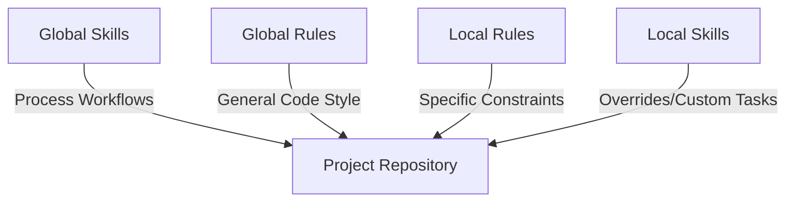

# .agents (Global Configuration)

This repository contains global configurations, guidelines, rules, and skills that help maintain consistency across all software projects. Agents operating in this workspace should adhere to the conventions defined here.

## 1. Workspace Setup & Discovery

To ensure AI agents can discover and load these global skills and rules, **you must include this `.agents` directory as a root directory in your workspace**. 

For example, when using multi-root workspaces:
- Include the directory `/Users/alexcaulfield/src/.agents` alongside your active project directories (e.g., `/Users/alexcaulfield/src/wedding-website`).

---

## 2. Project Conventions

Every project repository is expected to maintain standard documents at its root. These files provide context for AI agents during planning, implementation, and debugging.

### Standard Files

| File | Required? | Purpose |
| :--- | :--- | :--- |
| `README.md` | **Yes** | Project overview, goals, setup instructions, and execution commands. |
| `ARCHITECTURE.md` | **Yes** | Technical stack, core design patterns, directory structure, constraints, and integration boundaries. |
| `DESIGN_SYSTEM.md` | *Optional* | Project design system including typography, color palette, shapes, depth rules, and Tailwind / CSS conventions (applicable to front-end projects). |

### Feature & Refactoring Plans (`/plans`)

All projects must support a `/plans` directory at their root:
* **Workflow:** Before writing code for significant changes, agents use the `feature-planner` or `bug-fixer` skill to design the implementation.
* **Storage:** Once approved by the user, plans must be saved to the `/plans` directory.
* **Naming Convention:** Plans must be saved as Markdown files using the format: `YYYY-MM-DD-feature-name.md` (e.g., `/plans/2026-05-23-global-agents-config.md`).
* **Lifecycle:** Every plan tracks status in its header (e.g., `Status: proposed | approved | implemented | superseded`).

---

## 3. Agent Layering Model

We utilize a hybrid model of **Global Configurations** and **Project-Local Overrides** to balance project-agnostic workflows with project-specific code constraints.

### Global Skills
Global skills are project-agnostic workflows located in `/.agents/skills/`. They define the *process* of how tasks should be planned, executed, and saved:
* [feature-planner](file:///Users/alexcaulfield/src/.agents/skills/feature-planner/SKILL.md) - For planning, architecting, and designing new feature implementations using a standardized plan template.
* [project-init](file:///Users/alexcaulfield/src/.agents/skills/project-init/SKILL.md) - For bootstrapping a new side-project repository with standard directories and files.
* [bug-fixer](file:///Users/alexcaulfield/src/.agents/skills/bug-fixer/SKILL.md) - For systematically troubleshooting, performing root cause analysis, and deploying robust bug fixes.

### Global Rules
Global rules are project-agnostic code standards stored in `/.agents/rules/` that apply across all projects:
* [commenting-style](file:///Users/alexcaulfield/src/.agents/rules/commenting-style.md) - Enforces self-documenting code and only writing comments when logic is genuinely complicated or hard to read.

### Project-Local Rules
Project-local rules are stored in `<project-root>/.agents/rules/` (e.g., `lit-component-styles.md`). They define *coding constraints* that apply only to that specific repository. 
* These rules are marked with `always_on: true` to ensure that any agent editing files in that repository automatically obeys its specific styles and constraints.

### Project-Local Skills
For workflows unique to a single project, custom skills can be defined in `<project-root>/.agents/skills/`. If a project-local skill has the same name as a global skill, the local skill will take precedence as an override.

